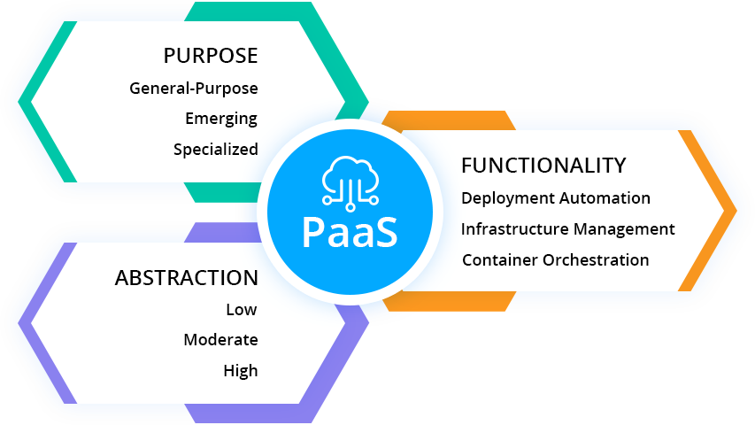

### What Does PaaS Mean?

Platform as a Service (PaaS) is a type of cloud computing model that provides a platform for users to build, execute, and oversee applications. This eliminates the need to deal with the complexity of setting up and managing the infrastructure usually required for developing and deploying applications.

### Overview of AWS Amplify

AWS Amplify is a collection of specialized tools and services aimed at helping web and mobile developers build full-stack applications swiftly on AWS. It allows you to adapt your app as your requirements grow, making it simple to use a wide range of AWS services. Key features include:

Quickly setting up a backend for your app.
Visually designing and constructing a user interface.
Managing app content outside the AWS Management Console.
Streamlined deployment and effortless scalability.
Explore more details about AWS Amplify here.

### Steps to Deploy an Application Using AWS Amplify:

Access the AWS Console
Log in to your AWS account and navigate to the main dashboard.
Search for Amplify
Type "AWS Amplify" into the search bar and select it from the results.
Start Using Amplify
Click on the Amplify service and select Host a Web App.
Authorize with GitHub
Opt to deploy with GitHub and log in to your GitHub account.
Select Your Repository
Pick the repository where your source code is stored. Specify a subdirectory if required.
Deploy the Application
Configure and launch your app using Amplify’s default settings. The configuration may vary depending on the framework you’re using (e.g., React).
🎉 Congratulations!
Your application is now successfully hosted and live with AWS Amplify.
